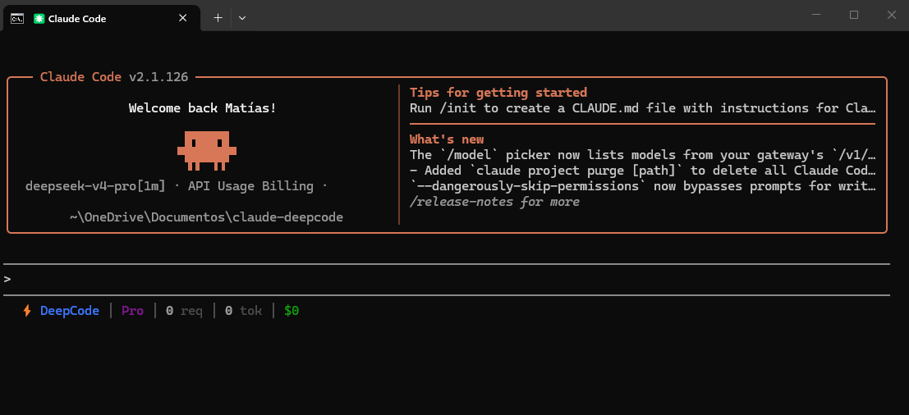

# DeepCode V4

🇺🇸 *[Read in English](./README.md)*



**DeepSeek V4 Pro + Claude Code + Visión Local.** Un solo comando. El proxy definitivo que hace funcionar DeepSeek de forma transparente como si fuera Claude — con tools nativas, 1 millón de tokens de contexto, y **soporte de imágenes** vía LLM local. Todo por una fracción del costo.

## ✨ ¿Qué hace especial a DeepCode?

- 👁️ **Visión con DeepSeek** — DeepSeek no soporta imágenes. DeepCode sí. Auto-detecta Ollama o LM Studio y le da ojos a DeepSeek usando un modelo de visión local. Sin configurar nada.
- 🧠 **Soporte Nativo Thinking Mode** — Renderiza el razonamiento (R1) de DeepSeek directamente en el bloque colapsable `∴ Thinking…` de Claude Code. Soporta tool-calls encadenadas sin perder contexto.
- 🎛️ **Control de Esfuerzo Nativo** — Usa el comando `/effort low` o `/effort max` en la consola; el proxy traduce en tiempo real los tokens al motor de DeepSeek.
- 🔧 **100% compatible con Claude Code** — Mismos flags, mismas tools, mismo entorno. Usa `deepcode` igual que usarías `claude`.
- 💰 **95% más barato** — DeepSeek V4 Pro cuesta ~$0.04 por cada $0.90 de Claude Sonnet.
- 🔄 **Continúa sesiones de Claude** — ¿Se te acabaron los tokens? `deepcode --resume` y sigues donde lo dejaste.
- 📊 **Statusline en tiempo real** — Tokens consumidos y costo directo en la barra inferior de Claude Code.

## 📦 Requisitos Previos

Antes de instalar DeepCode, asegúrate de tener:

1. **Claude Code** instalado y funcionando en tu sistema. Puedes instalarlo siguiendo la [guía oficial de Anthropic](https://docs.anthropic.com/en/docs/claude-code/overview).
2. **API Key de DeepSeek V4** — Obtén tu clave en [platform.deepseek.com](https://platform.deepseek.com). DeepCode usa esta API key para enrutar las peticiones hacia DeepSeek V4 Pro.

> [!IMPORTANT]
> Sin Claude Code instalado, `deepcode` no podrá ejecutarse. Sin una API key de DeepSeek válida, no se podrán procesar las peticiones.

## 🚀 Instalación

```bash
npm install -g deepcode-v4
```

En el **primer arranque**, si no encuentra `DEEPSEEK_API_KEY`, DeepCode te la pide por consola (input enmascarado), valida el formato (`sk-...`) y la guarda globalmente en `~/.deepcode-v4/.env`. Solo lo haces **una vez** — funciona para todos tus proyectos, sin tener que crear un `.env` por proyecto.

```bash
deepcode            # Primer uso → pide la API key y arranca
deepcode --setup    # Reconfigura o reemplaza la key guardada
```

Obtén tu key en [platform.deepseek.com/api_keys](https://platform.deepseek.com/api_keys).

## 📋 Uso

```bash
deepcode                              # Nueva sesión
deepcode "crea una API REST con Express" # Prompt directo
deepcode --setup                      # Configurar o reemplazar DEEPSEEK_API_KEY global
deepcode --no-vision                  # Exclusivo de DeepCode: Desactiva la visión auto-detectada

# --- Flags Nativos de Claude Code ---
# DeepCode es un wrapper transparente, así que cualquier flag nativo funciona perfecto:
deepcode --resume                     # Abre un menú interactivo para continuar sesiones
deepcode --resume <session-id>        # Continúa una sesión específica directamente usando su ID
deepcode --dangerously-skip-permissions  # Modo autónomo (aprueba todas las herramientas automáticamente)
```

Cualquier otro flag de `claude` funciona con `deepcode`.

**Comandos nativos dentro de la consola:**
- `/effort low` o `/effort max`: Controla el tiempo y la profundidad del pensamiento de DeepSeek en tiempo real.
- `/model sonnet`: Cambia al instante a la versión ultra-rápida `deepseek-v4-flash`.

## ⚙️ Configuración

El setup interactivo del primer arranque cubre el caso común. Para configuraciones avanzadas, `DEEPSEEK_API_KEY` se resuelve con esta precedencia:

1. Variable de entorno del shell (`export DEEPSEEK_API_KEY=sk-...`)
2. Archivo `.env` con búsqueda walk-up desde el directorio actual (override por proyecto)
3. `~/.deepcode-v4/.env` (global, escrito por `deepcode --setup`)

Ejecuta `deepcode --setup` cuando quieras reemplazar la key guardada. Revisa `.env.example` para todas las vars opcionales (overrides de modelo, retry, timeouts, telemetría).

> ⚠️ **Seguridad:** Tu API key se queda en tu máquina local. El archivo global `~/.deepcode-v4/.env` se crea con permisos `0600` en POSIX. Si pones un `.env` dentro de un proyecto, recuerda agregar `.env` a tu `.gitignore`.

## 👁️ Visión Local (Auto-detectada)

DeepSeek no puede ver imágenes. **DeepCode le da ojos.**

Al ejecutar `deepcode`, el proxy detecta automáticamente si tienes un LLM de visión local corriendo. Si lo encuentra, intercepta las imágenes, las convierte en descripciones textuales detalladas y se las pasa a DeepSeek para que razone sobre ellas. Si no encuentra un LLM local, funciona normal en modo texto.

**Activar visión (3 pasos):**
1. Instala [Ollama](https://ollama.com)
2. `ollama pull qwen2-vl:7b`
3. Ejecuta `deepcode` — la visión se activa sola

**Modelos recomendados:**
| Modelo | VRAM | Calidad |
|--------|------|---------|
| `qwen2-vl:7b` | ~5 GB | Muy buena |
| `qwen3-vl:8b` | ~6 GB | Excelente |
| `llava:7b` | ~5 GB | Buena |
| `moondream` | ~2 GB | Ligera |

También soporta **LM Studio** (`localhost:1234`).

## 📜 Licencia

MIT
