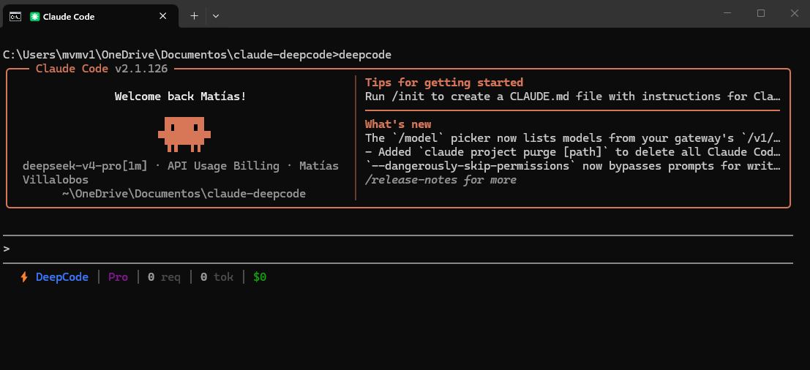

# DeepCode V4



Este proyecto es un proxy avanzado basado en el repositorio oficial de DeepSeek, diseñado para funcionar como un intermediario perfecto entre **Claude Code** y los modelos de DeepSeek. Está impulsado por el **cerebro de DeepCode V4 Pro**, lo cual le otorga una mayor compatibilidad y precisión al utilizar las herramientas (*tools*) nativas de Claude Code.


## 🌟 Características Principales

- **Cerebro de DeepCode V4 Pro**: Mejor interpretación, compatibilidad y ejecución de las llamadas a herramientas (*tool-calling*) nativas de Claude Code.
- **Transparencia Total con Claude Code**: Soporta los flags nativos de la CLI de Claude.
- **Barra de estado integrada (Statusline)**: Muestra en tiempo real los tokens consumidos y el costo directamente en la interfaz inferior de Claude Code.
- **Caché y Optimización**: Mantiene los *breakpoints* de caché (*prompt-cache*) de Anthropic para ahorrar tokens y corrige comportamientos inestables de *streaming* (SSE).

## 🚀 Instalación y Uso

Instala la herramienta globalmente utilizando npm:

```bash
npm install -g deepcode-v4
```

Una vez instalado, el comando principal para iniciar la aplicación es `deepcode`.

### Comandos y Ejemplos de Uso

Puedes usar el comando `deepcode` de la misma manera que usarías `claude code`. El proxy se encargará de traducir todo en segundo plano.

- **Iniciar una nueva sesión:**
  ```bash
  deepcode
  ```

- **Continuar una sesión anterior:**  
  Funciona exactamente igual que el comando nativo `claude --resume`:
  ```bash
  deepcode --resume
  ```

- **Saltar confirmación de permisos (Modo automático):**  
  Al igual que con Claude Code, puedes usar el flag de permisos peligrosos para que la IA actúe de forma autónoma sin pedir confirmación:
  ```bash
  deepcode --dangerously-skip-permissions
  ```

*Nota: Cualquier otro flag compatible con `claude code` puede pasarse directamente al comando `deepcode`.*

## ⚙️ Configuración y Seguridad

Necesitas configurar tu `DEEPSEEK_API_KEY`. Puedes hacerlo de las siguientes maneras:
- Creando un archivo `.env` en la misma carpeta donde vas a trabajar y ejecutar el comando.
- Configurando la variable de entorno globalmente en tu sistema o terminal.
- Creando un archivo `.env` en tu directorio de usuario: `~/.deepcode-v4/.env` (recomendado para uso global).

*(Revisa el archivo `.env.example` incluido en este repositorio para ver cómo estructurarlo y otras configuraciones adicionales disponibles).*

> ⚠️ **Seguridad de tu API Key:**  
> Tu clave de API está perfectamente protegida a nivel local en tu entorno. Sin embargo, si decides crear el archivo `.env` directamente en la carpeta del proyecto en el que estás trabajando con Claude, **recuerda agregar `.env` al archivo `.gitignore` de tu proyecto**. Así evitarás subir accidentalmente tu clave a GitHub.

## 🛠️ Utilidades Adicionales (Resumen)

El paquete incluye otros comandos secundarios que se instalan junto con el principal:

- **`deepcode`**: El comando principal que levanta el proxy y lanza la sesión de Claude conectada a DeepSeek V4 Pro.
- **`deepcode-clean`**: Sanitiza y limpia los archivos de historial de Claude Code (`.jsonl`) para facilitar la portabilidad si decides cambiar de API.
- **`deepcode-statusline`**: Comando de utilidad interna. Permite instalar o desinstalar la barra de consumo de tokens en la interfaz de Claude Code (`--install` / `--uninstall`).

## 📜 Licencia

Este proyecto está bajo la Licencia MIT.
